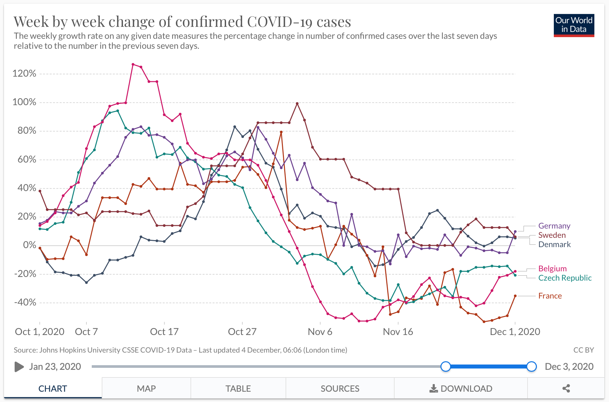

The following graphs are based on Covid-19 cases data from Johns Hopkins University and Google mobility data for the time period Oct 1st - Dec 4th, 2020.

```{r setup, include=FALSE}
library(tidyverse)
library(readr)
library(plotly)
library(tufte)
library(ggplot2)
library(zoo)
library(scales)

library(extrafont)
# this line is not very portable. You might need to remove the references to ETBembo below
font_import(paths = "~/Library/Fonts/", pattern = "*et*", prompt = FALSE)

getOutputFormat <- function() {
  output <- rmarkdown:::parse_yaml_front_matter(
    readLines(knitr::current_input())
    )$output
  if (is.list(output)) {
    return(names(output)[1])
  } else {
    return(output[1])
  }
}

if (grepl("tufte_html", getOutputFormat())) {
  
  our_theme <- theme_minimal() + 
    theme(text = element_text(family="et-book"), 
          plot.background = element_rect(fill = "#fffff8"),
          panel.background = element_rect(fill = "#fffff8"))
}else{
  our_theme <- theme_minimal() + 
  theme(text=element_text(family = "ETBembo", size=8))
}

plot_fun <- function(gg){
  if (grepl("html", getOutputFormat())){
    ggplotly(gg)
  } else {gg}
}
knitr::opts_chunk$set(echo = TRUE, fig.pos = "!h")

countries <- c("Sweden", "Germany", "Denmark", "Belgium", "France", "Czech Republic", "Czechia", "Austria", "United Kingdom", "Slovakia")
colors <- c("#F8766D", "#D3920070", "#93AA0070", "#00BA3870", "#00C19F70", "#00B9E370", "#619CFF70", "#DB72FB70", "#FF61C370")
```


# Case numbers

```{r cases, fig.fullwidth = FALSE,  include=TRUE, echo=FALSE, message = FALSE, warning = FALSE}

df_jhu <- read_csv("data/subset_jhu.csv")
df_jhu <- transform(df_jhu, Country = factor(Country, levels = countries))

g <- ggplot(df_jhu,
            aes(x = Date, 
                y = mean_cases_per_cap, 
                color = Country)) + 
  geom_line() + 
  ggtitle("Covid - 19 - Second wave") +
  ylab("Cases per 100,000") +
  scale_x_date(date_breaks = "1 month", 
               limits = as.Date(c('2020-10-01','2020-12-04')),
               labels = date_format("%b")) +
  our_theme +
  theme(legend.position = "none") +
  facet_wrap(~ Country)

plot_fun(g)
```

## Rate of change
Measuring the weekly change of new cases^[This data is also available on [Our World in Data](https://ourworldindata.org/coronavirus-data-explorer?zoomToSelection=true&time=2020-10-01..2020-12-01&country=DNK~FRA~CZE~DEU~BEL~SWE&region=World&casesMetric=true&interval=weeklyChange&perCapita=true&smoothing=0&pickerMetric=total_deaths&pickerSort=desc) ] enables a clearer way to show the dynamic of infections. In this diagram the peak occurs at the date the increase in new cases started slowing down. If the curve dips below zero,  new detected cases have *started decreasing*.

One can see that the *lockdown light* - countries have not yet started decreasing, whereas most of the others hit have.

```{r rate_of_change, fig.fullwidth = FALSE,  include=TRUE, echo=FALSE, message = FALSE, warning = FALSE}
g<-ggplot(df_jhu,
          aes(x = Date, 
              y = rate, 
              color = Country)) +
  geom_hline(yintercept=0, linetype="dashed") +
  geom_smooth(method="auto" , se=TRUE, span = 0.3, aes(y=rate), level = 0.999, size=.10) +
  ylab("Rate of change") +
  ggtitle("Covid-19 Second wave - Rate of Change") +
  scale_y_continuous(labels = scales::percent_format( scale = 1.0, accuracy = 1), limits = c(-75, 125)) +
  scale_x_date(date_breaks = "1 month", 
               limits = as.Date(c('2020-10-01','2020-12-02')),
               labels = date_format("%b")) +
  our_theme +
  theme(legend.position = "none") +
  facet_wrap(~ Country)

plot_fun(g)
```

\newpage

# Mobility - Overview

We also look at mobility trends for the nine countries based on [Google´s data](https://www.google.com/covid19/mobility/). ^[Again, for a description of the data and an interactive version, go to [Our world In Data](https://ourworldindata.org/covid-mobility-trends).] Here we look at how Sweden compares with other countries over the course of the pandemic. Sweden´s different approach is most pronounced in the spring, but Sweden is among the countries that changed their behaviour the least in all categories until early december.

```{r mob_overview, fig.fullwidth = TRUE,  include=TRUE, echo=FALSE, message = FALSE, warning = FALSE}
Subset_Mobility_Data_long <- read_csv("data/Subset_Mobility_Data_long.csv")
Subset_Mobility_Data_long <- transform(Subset_Mobility_Data_long, Country = factor(Country,levels=countries) )

g <- ggplot(Subset_Mobility_Data_long %>% 
              filter(Mobility_Type != "Parks") %>% 
              filter(Mobility_Type != "Residential"), 
            aes(x = Date, 
                y = Change, 
                color = Country)) + 
  geom_line() + 
  our_theme +
  ggtitle("Google Mobility Report") +
  scale_color_manual(name = "Country", values = colors) +
#  theme(legend.title = element_blank(), legend.position = "none") +
  ylab("Change from baseline") +
  scale_y_continuous(labels = scales::percent_format(scale = 1)) +
  facet_wrap(~ Mobility_Type)
plot_fun(g)
```

```{r r_n_r1, fig.fullwidth = FALSE,  include=FALSE, echo=FALSE, message = FALSE, warning = FALSE}

plot_mob_cat <- function (Mob_Type)  
{
  ggplot(Subset_Mobility_Data_long %>% filter(Mobility_Type == Mob_Type),
         aes(Date, Change,
             color = Country)) + 
    geom_line() +
    our_theme +
    ggtitle(paste("Google Mobility - ", Mob_Type)) +
    ylab("Change from baseline") +
    scale_y_continuous(labels = scales::percent_format(scale = 1)) +
    scale_color_manual(name = "Country", values = colors)+
    geom_hline(yintercept=0, linetype="dashed") 
}
plot_fun(plot_mob_cat("Retail & recreation"))
```

# Mobility - Second Wave

In the following, we compare the change in behaviour in all countries to the rate of change of cases. 

## Retail & Recreation

```{r r_n_r, fig.fullwidth = FALSE, include=TRUE, echo=FALSE, message = FALSE, warning = FALSE}

plot_mob_facet <- function (Mob_Type)  
{
  g<-ggplot(transform(Subset_Mobility_Data_long, Country = factor(Country, levels=countries)) %>% 
              filter(Mobility_Type == Mob_Type),
            aes(Date, Change,
                color = Country)) + 
    geom_line() +
    geom_smooth(data = df_jhu, method = "auto", se = TRUE, span = 0.3,
              level = 0.999, aes(y = rate), size=.10) +
    our_theme +
    theme(legend.position = "none") +
    ggtitle(paste("Google Mobility - ", Mob_Type, "vs Change in Cases")) +
    ylab("Change from baseline") +
    scale_y_continuous(labels = scales::percent_format(scale = 1)) +
    geom_hline(yintercept=0, linetype="dashed")  +
    scale_x_date(date_breaks = "1 month",
                 limits = as.Date(c('2020-10-01','2020-12-02')),
                 labels = date_format("%b")) +
    facet_wrap(~ Country)
  return(g)
}
plot_fun(plot_mob_facet("Retail & recreation"))
```

## Workplaces

```{r workplaces2, fig.fullwidth = FALSE,  include=TRUE, echo=FALSE, message = FALSE, warning = FALSE}
plot_fun(plot_mob_facet("Workplaces"))
```

## Transit stations

```{r transit2, fig.fullwidth = FALSE,  include=TRUE, echo=FALSE, message = FALSE, warning = FALSE}
plot_fun(plot_mob_facet("Transit stations"))
```

## Grocery & pharmacy

```{r grocery2, fig.fullwidth = FALSE,  include=TRUE, echo=FALSE, message = FALSE, warning = FALSE}
plot_fun(plot_mob_facet("Grocery & pharmacy"))
```

## Residential Change

```{r residential2, fig.fullwidth = FALSE,  include=TRUE, echo=FALSE, message = FALSE, warning = FALSE}
plot_fun(plot_mob_facet("Residential"))
```
